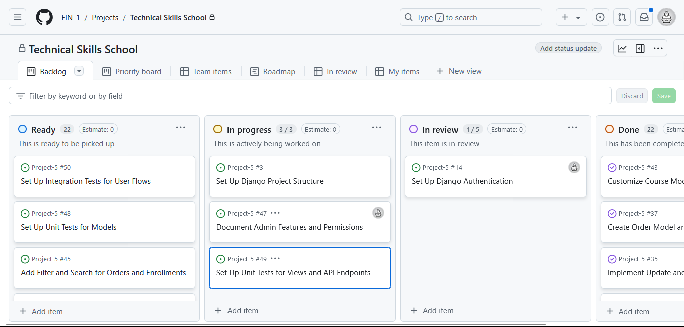
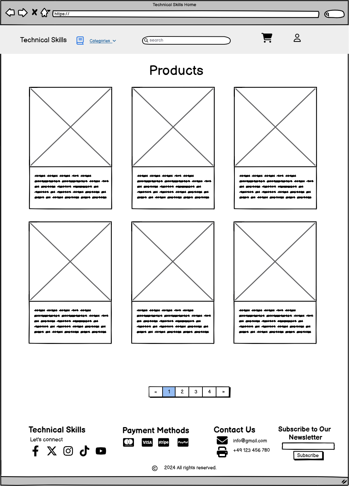

# Technical Skills
Welcome to **Technical Skills!** This project is designed to help users access the most relevant courses for the technical skills they seek to learn. Whether you're a beginner looking to get started or an advanced user seeking specialized knowledge, Technical Skills has comprehensive suite of courses, and expert guidance to support your goals.

Built with Django, JavaScript, and Bootstrap, this platform is highly scalable, easy to navigate and scalable, making it a perfect solution for learners and curious people.

Why Choose **Technical Skills?**

> - Simplifies the skill search process with a user-friendly interface.
> - Provides an intuitive course catalog and a robust search functionality.
> - Built with performance and scalability in mind, supporting thousands of users and courses.

View Live Site [Technical Skills](https://pages.github.com/).

# Project

## Objective
To provide users with a clear path to begin or strengthen their technical skills by offering guidance on relevant courses and learning opportunities, especially for those unsure of where to start or which skills to pursue. This has been done to demonstrate my knowledge of the Django Framework, Python, JavaScript, CSS and HTML.

## Site Users Goal
To find tailored learning paths and relevant courses that support the users' technical skill development, helping them confidently choose where to start and progress toward their career or personal learning objectives.

## Site Owner Goal
To provide a well-organized and user-friendly platform that connects users with high-quality technical courses, boosting engagement and satisfaction while driving course enrollments and fostering a community of lifelong learners.

# Business Model
1. ## Target Audience
	- **Primary Users**: Individuals seeking to learn or reinforce technical skills but unsure of where to begin or which courses to take.
	- **Secondary Users**: Employers or organizations looking to upskill employees through curated courses.
2. ## Value Proposition
	- **For Learners**: A centralized platform offering tailored recommendations to guide users in discovering courses that align with their skill level, learning goals, and career ambitions.
	- **For Organizations**: A resource for enabling focused technical training and skill development for employees.
3. ## Revenue Streams
	- **Course Sales**: Revenue generated from one-time course purchases or subscriptions.
	- **Featured Course Listings**: Paid placement for course providers to have their courses featured prominently on the platform.
	- **Corporate Partnerships**: Offering tailored packages for companies interested in upskilling employees, potentially with bulk pricing or access to exclusive content.
	- **Affiliate Links**: Earning a commission by partnering with other educational platforms or providers and directing traffic through affiliate links.
4. ## Cost Structure
	- **Platform Development & Maintenance**: Regular updates, bug fixes, and feature improvements to ensure a seamless user experience.
	- **Marketing & Outreach**: Campaigns targeting learners and organizations through social media, SEO, content marketing, and partnerships.
	- **Customer Support**: Providing support for learners and partners to improve satisfaction and resolve issues.
5. ## Key Partners
	- **Course Providers**: Partnering with subject matter experts, institutions, and tech platforms to offer diverse, high-quality courses.
	- **Tech Platforms**: Integrations with payment processors (like Stripe) and analytics tools to enhance service offerings.
	- **Affiliate Partners**: External platforms that offer specialized or complementary courses to expand course options.
6. ## Channels
	- **Web Platform**: The main interface for users to browse, purchase, and participate in courses.
	- **Email Marketing**: Reaching out to users with new course recommendations, discounts, and personalized learning suggestions.
	- **Social Media Presence**: Engaging with the community, sharing success stories, and promoting trending courses.
8. ## Key Activities
	- **Platform Development**: Regularly developing new features, ensuring compatibility, and maintaining high usability.
	- **Course Curation & Quality Control**: Selecting and featuring courses that align with user needs and maintain high standards.
	- **Marketing & Customer Acquisition**: Implementing strategies to attract new users and improve brand visibility.

# Marketing Techniques
1. ## Social Media Campaigns
	- **Targeted Ads**: Use ads on platforms like Facebook, Instagram, and LinkedIn, focusing on audiences interested in skill-building and professional development.
	- **Influencer Partnerships**: Collaborate with industry influencers or tech educators who can share insights about the courses available on the platform.
	- **Live Sessions & Webinars**: Host free live sessions, webinars, or Q&As on social channels to demonstrate the value of selected courses.

2. ## Email Marketing
	- **Personalized Course Recommendations**: Send emails with course suggestions based on users' interests, previous searches, or completed courses.
	- **Weekly Newsletters**: Share the latest courses, learning resources, and trending tech topics in a newsletter format.
	- **Promotional Campaigns**: Offer discounts on popular courses during peak enrollment times, such as the start of the year, new job cycles, or key industry events.

3. ## Search Engine Optimization (SEO)
	- **Keyword Targeting**: Optimize the website and course descriptions for terms such as “learn tech skills,” “beginner coding courses,” and “best online tech courses.”
	- **Technical SEO**: Improve load times, mobile responsiveness, and accessibility to rank higher in search results.
	- **Backlinking**: Build partnerships and gain backlinks from reputable tech blogs, educational websites, and industry publications to boost site authority.

4. ## Affiliate & Referral Program
	- **Referral Incentives**: Reward users who refer friends with discounts on their next course or access to exclusive content.
	- **Affiliate Partnerships**: Collaborate with career development websites, tech bloggers, and educational platforms to promote courses and receive commissions on sales generated through affiliates.

5. ## Corporate Partnerships and B2B Outreach
	- **Upskilling Programs for Businesses**: Market directly to businesses interested in upskilling employees, offering volume discounts and custom learning paths.
	- **LinkedIn Outreach**: Network with HR and L&D professionals on LinkedIn, promoting the platform as a valuable resource for employee development.

6. ## Community Building
	- **Discussion Forums & Peer Support**: Create a space where users can ask questions, share learning experiences, and get advice, fostering a community feeling.
	- **User-Generated Content**: Encourage users to share their projects, code snippets, or experiences, and feature the best examples on the platform’s social channels or blog.

7. ## Influencer & Industry Partnerships
	- **Guest Appearances on Podcasts and Webinars**: Partner with influencers or thought leaders to appear in their content, introducing the platform to a wider audience.
	- **Collaborations with Online Tech Communities**: Work with platforms like GitHub, Stack Overflow, or specialized subreddits to engage with users in their preferred learning spaces.

8. ## Paid Advertising
	- **Google Ads & Retargeting**: Use Google Ads to reach users searching for technical courses and retarget site visitors who didn’t complete purchases.
	- **Seasonal & Limited-Time Offers**: Run promotional campaigns around significant times like "Back to School" or "New Year, New Skill" campaigns to capitalize on users’ learning motivations.

# Project Management
This project was managed using GitHub's project management tools to ensure organized and efficient development. GitHub Projects and Issues were utilized to create a Kanban-style workflow, which allowed the team to track progress and prioritize tasks effectively. Each task or bug was represented as an "Issue," and labeled based on its type (e.g., "feature," "bug," "enhancement") for quick categorization.

**The Kanban board** provided visibility into the project’s workflow by dividing tasks into stages, such as "To Do," "In Progress," and "Completed." This helped maintain an organized workflow, identify bottlenecks, and keep team members aligned on priorities.

Using GitHub’s tools allowed for seamless version control and communication within the team, ensuring that every change was documented and linked to the relevant tasks, fostering transparency and accountability across the project.

# Database Schema

This document outlines the database schema used in the e-learning Django project, describing each model and the relationships among them.

## 1. Category Table

- **Fields**:
  - `id`: (Primary Key, Auto-generated by Django)
  - `name`: Name of the category (CharField, max length 254)
  - `description`: Description of the category (TextField)
  
- **Description**: Contains course categories to help organize and filter the courses on the platform.

- **Relationships**:
  - Each `Product` (course) has a foreign key to a single `Category`.

## 2. Product Table

- **Fields**:
  - `id`: (Primary Key, Auto-generated by Django)
  - `courseName`: Name of the course (CharField, max length 254)
  - `instructor`: Name of the instructor (CharField, max length 254)
  - `courseUrl`: URL for more course information (URLField, optional)
  - `imageUrl`: URL to the course image (URLField, optional)
  - `description`: Detailed description of the course (TextField)
  - `category`: Foreign key to `Category` (on_delete=PROTECT, optional)
  - `rating`: Course rating (DecimalField, max_digits=6, decimal_places=2, optional)
  - `reviews`: Number of course reviews (IntegerField, optional)
  - `duration`: Duration of the course in hours (DecimalField, max_digits=6, decimal_places=2)
  - `lectures`: Number of lectures in the course (IntegerField, optional)
  - `level`: Course difficulty level (CharField, max length 50)
  - `price`: Course price (DecimalField, max_digits=10, decimal_places=2)
  - `flag`: Boolean indicating whether the course is featured
  - `students`: Number of enrolled students (IntegerField, optional)
  
- **Description**: Stores comprehensive details about each course offered.

- **Relationships**:
  - Each course belongs to a single `Category`.

## 3. Cart Table

- **Fields**:
  - `id`: (Primary Key, Auto-generated by Django)
  - `user`: Foreign key to `User` (on_delete=CASCADE, optional)
  - `created_at`: Timestamp of when the cart was created (DateTimeField, auto_add_now)
  
- **Description**: Manages cart associations for users, storing temporary order data before checkout.

- **Relationships**:
  - Each cart has a one-to-many relationship with `CartItem`, linking multiple items to a single cart.

## 4. CartItem Table

- **Fields**:
  - `id`: (Primary Key, Auto-generated by Django)
  - `cart`: Foreign key to `Cart` (on_delete=CASCADE)
  - `product`: Foreign key to `Product` (on_delete=CASCADE)
  
- **Description**: Stores individual items within each cart, associating products with a specific user’s cart.

- **Relationships**:
  - Each `CartItem` links a specific product to a cart.

## 5. Order Table

- **Fields**:
  - `id`: (Primary Key, Auto-generated by Django)
  - `user`: Foreign key to `User` (on_delete=PROTECT)
  - `amount`: Total amount for the order (IntegerField)
  - `stripe_id`: Stripe PaymentIntent ID for payment verification (CharField, max length 255)
  - `status`: Status of the order (e.g., Pending, Completed, Canceled) (CharField, max length 20)
  - `date`: Timestamp of when the order was created (DateTimeField, auto_add_now)
  
- **Description**: Stores completed orders with Stripe payment details and status.

- **Relationships**:
  - Each order has a one-to-many relationship with `OrderItems`, associating multiple purchased products with a single order.

## 6. OrderItems Table

- **Fields**:
  - `id`: (Primary Key, Auto-generated by Django)
  - `order`: Foreign key to `Order` (on_delete=PROTECT)
  - `product`: Foreign key to `Product` (on_delete=PROTECT)
  - `price`: Price at the time of purchase (IntegerField)
  
- **Description**: Logs the specific products purchased within each order, including price snapshots.

- **Relationships**:
  - Each `OrderItem` links a purchased product to an order, maintaining an association between items and orders.

---

## Relationships Summary

- **One-to-Many**:
  - Each `Category` can have multiple `Products`.
  - Each `Cart` can contain multiple `CartItems`.
  - Each `Order` can include multiple `OrderItems`.

- **Many-to-One**:
  - Each `Product` belongs to a single `Category`.
  - Each `OrderItem` and `CartItem` associates a single `Product` with an order or cart.

This schema provides a scalable, relational data structure suited for an e-learning platform with courses, shopping carts, and an integrated payment system.

# User Experience (UX)
## Wireframes
The wireframes for the site were created in the software Balsamiq. The wireframes have been created for desktop, tablet and mobile devices. The text content wasn't finalized during the wireframe process. It's also worth mentioning that there are some visual differences in the deployed version compared to the original wireframes, the reason being design choices that was made during the creation process.

