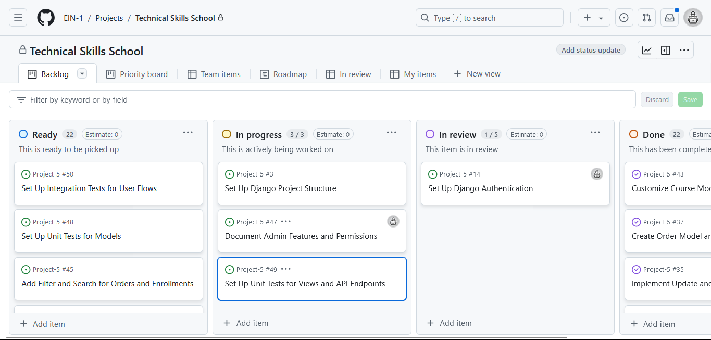
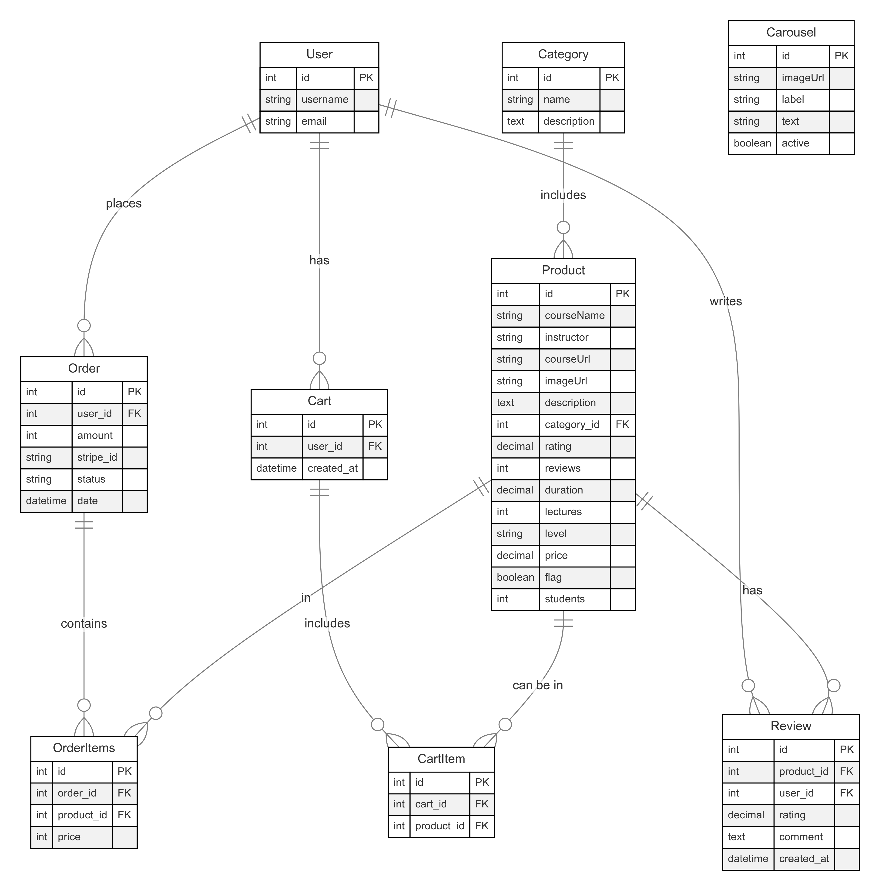
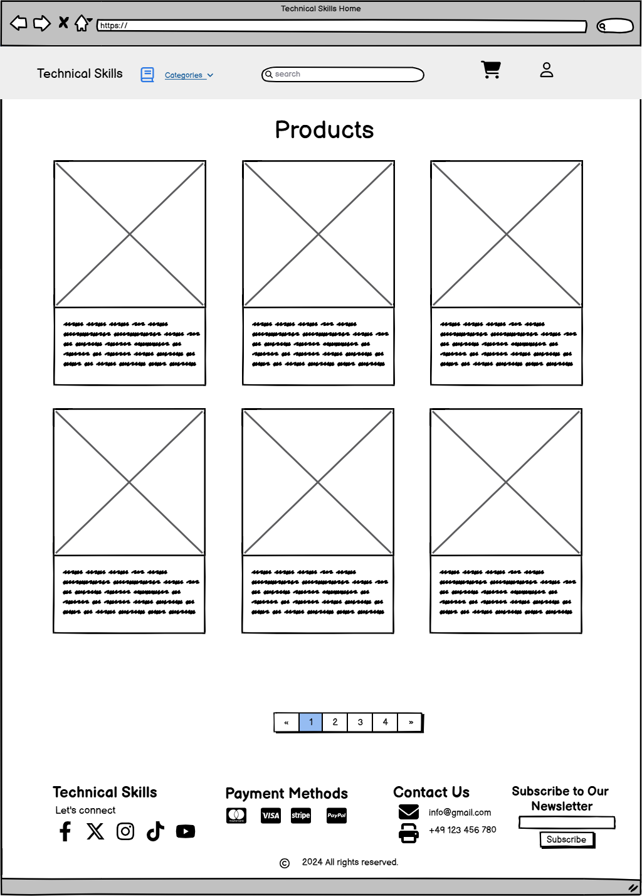
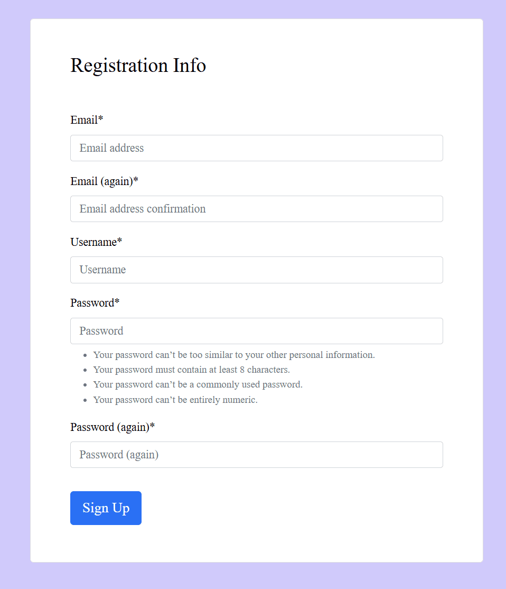
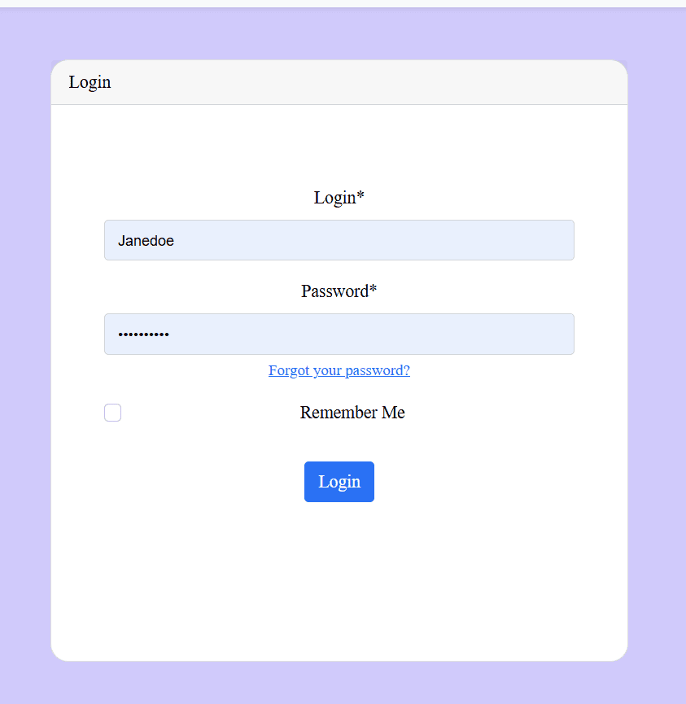

# Technical Skills
Welcome to **Technical Skills!** This project is designed to help users access the most relevant courses for the technical skills they seek to learn. Whether you're a beginner looking to get started or an advanced user seeking specialized knowledge, Technical Skills has comprehensive suite of courses, and expert guidance to support your goals.

Built with Django, JavaScript, and Bootstrap, this platform is highly scalable, easy to navigate and scalable, making it a perfect solution for learners and curious people.

Why Choose **Technical Skills?**

> - Simplifies the skill search process with a user-friendly interface.
> - Provides an intuitive course catalog and a robust search functionality.
> - Built with performance and scalability in mind, supporting thousands of users and courses.

View Live Site [Technical Skills](https://technical-skills-12c3cb7561cc.herokuapp.com/).

# 

## Objective
To provide users with a clear path to begin or strengthen their technical skills by offering guidance on relevant courses and learning opportunities, especially for those unsure of where to start or which skills to pursue. This has been done to demonstrate my knowledge of the Django Framework, Python, JavaScript, CSS and HTML.

## Site Users Goal
To find tailored learning paths and relevant courses that support the users' technical skill development, helping them confidently choose where to start and progress toward their career or personal learning objectives.

## Site Owner Goal
To provide a well-organized and user-friendly platform that connects users with high-quality technical courses, boosting engagement and satisfaction while driving course enrollments and fostering a community of lifelong learners.

# Business Model
# 
1. ## Target Audience
	- **Primary Users**: Individuals seeking to learn or reinforce technical skills but unsure of where to begin or which courses to take.
	- **Secondary Users**: Employers or organizations looking to upskill employees through curated courses.
2. ## Value Proposition
	- **For Learners**: A centralized platform offering tailored recommendations to guide users in discovering courses that align with their skill level, learning goals, and career ambitions.
	- **For Organizations**: A resource for enabling focused technical training and skill development for employees.
3. ## Revenue Streams
	- **Course Sales**: Revenue generated from one-time course purchases or subscriptions.
	- **Featured Course Listings**: Paid placement for course providers to have their courses featured prominently on the platform.
	- **Corporate Partnerships**: Offering tailored packages for companies interested in upskilling employees, potentially with bulk pricing or access to exclusive content.
	- **Affiliate Links**: Earning a commission by partnering with other educational platforms or providers and directing traffic through affiliate links.
4. ## Cost Structure
	- **Platform Development & Maintenance**: Regular updates, bug fixes, and feature improvements to ensure a seamless user experience.
	- **Marketing & Outreach**: Campaigns targeting learners and organizations through social media, SEO, content marketing, and partnerships.
	- **Customer Support**: Providing support for learners and partners to improve satisfaction and resolve issues.
5. ## Key Partners
	- **Course Providers**: Partnering with subject matter experts, institutions, and tech platforms to offer diverse, high-quality courses.
	- **Tech Platforms**: Integrations with payment processors (like Stripe) and analytics tools to enhance service offerings.
	- **Affiliate Partners**: External platforms that offer specialized or complementary courses to expand course options.
6. ## Channels
	- **Web Platform**: The main interface for users to browse, purchase, and participate in courses.
	- **Email Marketing**: Reaching out to users with new course recommendations, discounts, and personalized learning suggestions.
	- **Social Media Presence**: Engaging with the community, sharing success stories, and promoting trending courses.
8. ## Key Activities
	- **Platform Development**: Regularly developing new features, ensuring compatibility, and maintaining high usability.
	- **Course Curation & Quality Control**: Selecting and featuring courses that align with user needs and maintain high standards.
	- **Marketing & Customer Acquisition**: Implementing strategies to attract new users and improve brand visibility.

# Marketing Techniques
1. ## Social Media Campaigns
	- **Targeted Ads**: Use ads on platforms like Facebook, Instagram, and LinkedIn, focusing on audiences interested in skill-building and professional development.
	- **Influencer Partnerships**: Collaborate with industry influencers or tech educators who can share insights about the courses available on the platform.
	- **Live Sessions & Webinars**: Host free live sessions, webinars, or Q&As on social channels to demonstrate the value of selected courses.

2. ## Email Marketing
	- **Personalized Course Recommendations**: Send emails with course suggestions based on users' interests, previous searches, or completed courses.
	- **Weekly Newsletters**: Share the latest courses, learning resources, and trending tech topics in a newsletter format.
	- **Promotional Campaigns**: Offer discounts on popular courses during peak enrollment times, such as the start of the year, new job cycles, or key industry events.

3. ## Search Engine Optimization (SEO)
	- **Keyword Targeting**: Optimize the website and course descriptions for terms such as “learn tech skills,” “beginner coding courses,” and “best online tech courses.”
	- **Technical SEO**: Improve load times, mobile responsiveness, and accessibility to rank higher in search results.
	- **Backlinking**: Build partnerships and gain backlinks from reputable tech blogs, educational websites, and industry publications to boost site authority.

4. ## Affiliate & Referral Program
	- **Referral Incentives**: Reward users who refer friends with discounts on their next course or access to exclusive content.
	- **Affiliate Partnerships**: Collaborate with career development websites, tech bloggers, and educational platforms to promote courses and receive commissions on sales generated through affiliates.

5. ## Corporate Partnerships and B2B Outreach
	- **Upskilling Programs for Businesses**: Market directly to businesses interested in upskilling employees, offering volume discounts and custom learning paths.
	- **LinkedIn Outreach**: Network with HR and L&D professionals on LinkedIn, promoting the platform as a valuable resource for employee development.

6. ## Community Building
	- **Discussion Forums & Peer Support**: Create a space where users can ask questions, share learning experiences, and get advice, fostering a community feeling.
	- **User-Generated Content**: Encourage users to share their projects, code snippets, or experiences, and feature the best examples on the platform’s social channels or blog.

7. ## Influencer & Industry Partnerships
	- **Guest Appearances on Podcasts and Webinars**: Partner with influencers or thought leaders to appear in their content, introducing the platform to a wider audience.
	- **Collaborations with Online Tech Communities**: Work with platforms like GitHub, Stack Overflow, or specialized subreddits to engage with users in their preferred learning spaces.

8. ## Paid Advertising
	- **Google Ads & Retargeting**: Use Google Ads to reach users searching for technical courses and retarget site visitors who didn’t complete purchases.
	- **Seasonal & Limited-Time Offers**: Run promotional campaigns around significant times like "Back to School" or "New Year, New Skill" campaigns to capitalize on users’ learning motivations.

# Project Management
This project was managed using GitHub's project management tools to ensure organized and efficient development. GitHub Projects and Issues were utilized to create a Kanban-style workflow, which allowed the team to track progress and prioritize tasks effectively. Each task or bug was represented as an "Issue," and labeled based on its type (e.g., "feature," "bug," "enhancement") for quick categorization.

**The Kanban board** provided visibility into the project’s workflow by dividing tasks into stages, such as "To Do," "In Progress," and "Completed." This helped maintain an organized workflow, identify bottlenecks, and keep team members aligned on priorities.

Using GitHub’s tools allowed for seamless version control and communication within the team, ensuring that every change was documented and linked to the relevant tasks, fostering transparency and accountability across the project.



# Database Schema

This document outlines the database schema used in the e-learning Django project, describing each model and the relationships among them.

## 1. Category Table

- **Fields**:
  - `id`: (Primary Key, Auto-generated by Django)
  - `name`: Name of the category (CharField, max length 254)
  - `description`: Description of the category (TextField)
  
- **Description**: Contains course categories to help organize and filter the courses on the platform.

- **Relationships**:
  - Each `Product` (course) has a foreign key to a single `Category`.

## 2. Product Table

- **Fields**:
  - `id`: (Primary Key, Auto-generated by Django)
  - `courseName`: Name of the course (CharField, max length 254)
  - `instructor`: Name of the instructor (CharField, max length 254)
  - `courseUrl`: URL for more course information (URLField, optional)
  - `imageUrl`: URL to the course image (URLField, optional)
  - `description`: Detailed description of the course (TextField)
  - `category`: Foreign key to `Category` (on_delete=PROTECT, optional)
  - `rating`: Course rating (DecimalField, max_digits=6, decimal_places=2, optional)
  - `reviews`: Number of course reviews (IntegerField, optional)
  - `duration`: Duration of the course in hours (DecimalField, max_digits=6, decimal_places=2)
  - `lectures`: Number of lectures in the course (IntegerField, optional)
  - `level`: Course difficulty level (CharField, max length 50)
  - `price`: Course price (DecimalField, max_digits=10, decimal_places=2)
  - `flag`: Boolean indicating whether the course is featured
  - `students`: Number of enrolled students (IntegerField, optional)
  
- **Description**: Stores comprehensive details about each course offered.

- **Relationships**:
  - Each course belongs to a single `Category`.

## 3. Cart Table

- **Fields**:
  - `id`: (Primary Key, Auto-generated by Django)
  - `user`: Foreign key to `User` (on_delete=CASCADE, optional)
  - `created_at`: Timestamp of when the cart was created (DateTimeField, auto_add_now)
  
- **Description**: Manages cart associations for users, storing temporary order data before checkout.

- **Relationships**:
  - Each cart has a one-to-many relationship with `CartItem`, linking multiple items to a single cart.

## 4. CartItem Table

- **Fields**:
  - `id`: (Primary Key, Auto-generated by Django)
  - `cart`: Foreign key to `Cart` (on_delete=CASCADE)
  - `product`: Foreign key to `Product` (on_delete=CASCADE)
  
- **Description**: Stores individual items within each cart, associating products with a specific user’s cart.

- **Relationships**:
  - Each `CartItem` links a specific product to a cart.

## 5. Order Table

- **Fields**:
  - `id`: (Primary Key, Auto-generated by Django)
  - `user`: Foreign key to `User` (on_delete=PROTECT)
  - `amount`: Total amount for the order (IntegerField)
  - `stripe_id`: Stripe PaymentIntent ID for payment verification (CharField, max length 255)
  - `status`: Status of the order (e.g., Pending, Completed, Canceled) (CharField, max length 20)
  - `date`: Timestamp of when the order was created (DateTimeField, auto_add_now)
  
- **Description**: Stores completed orders with Stripe payment details and status.

- **Relationships**:
  - Each order has a one-to-many relationship with `OrderItems`, associating multiple purchased products with a single order.

## 6. OrderItems Table

- **Fields**:
  - `id`: (Primary Key, Auto-generated by Django)
  - `order`: Foreign key to `Order` (on_delete=PROTECT)
  - `product`: Foreign key to `Product` (on_delete=PROTECT)
  - `price`: Price at the time of purchase (IntegerField)
  
- **Description**: Logs the specific products purchased within each order, including price snapshots.

- **Relationships**:
  - Each `OrderItem` links a purchased product to an order, maintaining an association between items and orders.

---

## Relationships Summary

- **One-to-Many**:
  - Each `Category` can have multiple `Products`.
  - Each `Cart` can contain multiple `CartItems`.
  - Each `Order` can include multiple `OrderItems`.

- **Many-to-One**:
  - Each `Product` belongs to a single `Category`.
  - Each `OrderItem` and `CartItem` associates a single `Product` with an order or cart.

This schema provides a scalable, relational data structure suited for an e-learning platform with courses, shopping carts, and an integrated payment system.



# User Experience (UX)
## Wireframes
The wireframes for the site were created in the software Balsamiq. The wireframes have been created for desktop, tablet and mobile devices. The text content wasn't finalized during the wireframe process. It's also worth mentioning that there are some visual differences in the deployed version compared to the original wireframes, the reason being design choices that was made during the creation process.



# User Stories
Below the user stories for the project are listed to clarify why particular feature matters. These will then be tested and confirmed in the Testing section.

## 1. User Registration and Authentication
  - As a user, I want to be able to create an account so that I can access my purchased courses and manage my profile.
  - As a user, I want to securely log in and log out of my account to protect my personal information.
  - As a user, I want the option to reset my password so that I can regain access if I forget it.
## 2. Course Browsing and Discovery
  - As a user, I want to browse available courses so that I can find one that interests me.
  - As a user, I want to filter courses by categories (e.g., Development, Design, Marketing) so that I can quickly find courses relevant to my interests.
  - As a user, I want to view a course's details, such as the description, category, price, and an image, so that I can understand its value before purchasing.
## 3. Shopping Cart and Checkout
  - As a user, I want to add a course to my shopping cart so that I can continue browsing without losing my selection.
  - As a user, I want to view the contents of my cart so that I can review my selections before purchasing.
  - As a user, I want to remove courses from my cart if I change my mind before checkout.
  - As a user, I want to proceed to checkout and pay using Stripe so that I can securely purchase the course.
## 4. Payment Processing with Stripe
  - As a user, I want a secure and reliable payment process so that I can confidently complete my purchase.
  - As a user, I want to receive an email confirmation and a receipt after I’ve made a payment so that I have a record of my purchase.
## 5. Accessing Purchased Courses
  - As a user, I want to access a list of all the courses I’ve purchased so that I can go back to them whenever I want.
  - As a user, I want to be able to download any resources associated with the course so that I can review them offline if needed.
## 6. Course Management (Admin)
  - As an admin, I want to be able to create, update, and delete courses so that I can manage the course offerings.
  - As an admin, I want to categorize courses by topic or difficulty so that users can filter courses easily.
  - As an admin, I want to view sales and order histories so that I can understand the platform’s performance and popular courses.
## 7. User Profile Management
  - As a user, I want to update my personal information (like name, email) in my profile so that it stays accurate and up-to-date.
  - As a user, I want to view my order history and purchase details so that I can keep track of my learning investments.
## 8. Security and Privacy
  - As a user, I want my information to be stored securely and to feel confident my data is protected.
  - As a user, I want to receive notifications of any important updates or security-related changes so that I can stay informed and secure.
## 9. UI and User Experience
  - As a user, I want a clean, intuitive interface so that I can easily navigate and find the courses I need.
  - As a user, I want a responsive design so that I can access the platform easily from my phone, tablet, or desktop.
## 10. Notifications and Receipts
  - As a user, I want to receive a notification upon completing a purchase so that I’m immediately aware of my successful order.
  - As a user, I want an emailed receipt and access to my invoice details so that I have a permanent record of my transaction.


# Admin User Stories
## 1. Course Management
  - As an admin, I want to create, update, and delete courses, so that I can keep the course offerings current and relevant for users.
  - As an admin, I want to categorize courses, so that users can easily find courses in specific areas of interest.
  - As an admin, I want to add and update images for each course, so that users have a visual preview of what the course is about.
## 2. User Management
  - As an admin, I want to view a list of registered users, so that I can monitor and manage user activities.
  - As an admin, I want to activate or deactivate user accounts, so that I can control access for users who violate terms or security policies.
  - As an admin, I want to assign different roles users, so that responsibilities are clear within the admin team.
## 3. Order and Payment Management
  - As an admin, I want to view a list of all orders, so that I can track user purchases and sales data.
  - As an admin, I want to update the status of orders (e.g., processing, completed), so that I can ensure all orders are correctly tracked.
  - As an admin, I want to view payment details and history for each order, so that I can assist users with payment issues and verify transactions.

# Features
Our platform is a simple and efficient e-learning marketplace built with Django, allowing users to explore, purchase, and enroll in courses. Key features include:

## 1. User Authentication and Authorization
  - Secure registration, login, and logout system.
  - Role-based permissions for admins, staff, and regular users.
  - Password reset and email verification.
## 2. Course Management
  - Admin dashboard: Create, update, and delete courses easily from the admin panel.
  - Categorization: Assign courses to categories, helping users discover courses by topic or area of interest.
  - Course details: Each course includes a title, description, and cover image to provide users with a course overview.
## 3. Course Catalog and Search
  - Browse courses in an organized catalog view with filters by category and search functionality.
  - Display course details, including title, description, price, and ratings, to assist users in making informed decisions.
## 4. Shopping Cart and Checkout
  - Add multiple courses to a shopping cart before purchasing.
  - Remove items from cart.
  - Checkout and Payment Integration: Integrated with Stripe for secure, real-time payment processing.
## 5. Order History and Enrollment
  - View past orders and receipts for courses purchased.
  - Allowing users to easily view purchased courses.
## 6. Admin Panel for Content and User Management
  - Access to an admin dashboard where admins can:
  - Manage courses, users, orders, and enrollments.
  - View sales and analytics to monitor platform performance.
## 7. Responsive Design
  - Fully responsive UI for optimal viewing across devices, including mobile, tablet, and desktop.
## 8. Security and Privacy
  - Environment variable management for sensitive data (e.g., SECRET_KEY, Stripe API keys).
  - Secure user data handling with hashed passwords and secure payment processing via Stripe.

# Usage
The platform allows users to register, browse, purchase, and enroll in courses. Below are step-by-step instructions for using the main features:

## 1. Registering a New Account
# 
  - Go to the Register page.
  - Fill out the required details (username, email, password) and submit the form.
  - Check your email for a verification link (if email verification is enabled) and complete the verification to activate your account.
## 2. Logging In
# 
  - Navigate to the Login page.
  - Enter your registered email and password.
  - Upon successful login, you will be redirected to the homepage.
## 3. Browsing Courses
  - From the homepage, you can browse all available courses or filter by category to find courses that match your interests.
  - Use the search bar to look up specific courses by title or keyword.
## 4. Viewing Course Details
  - Click on any course card to open its tooltip.
  - The tooltip enables you to add the course to cart or view the course details.
  - Here, you can find a course description, price, and image preview.
  - If you’re interested, you can add the course to your shopping cart.
## 5. Adding Courses to the Shopping Cart
  - On a course's detail page, click Add to Cart to add it to your shopping cart.
  - You can view your shopping cart at any time by clicking the cart icon in the navigation bar.
## 6. Managing the Shopping Cart
  - In the cart, you can:
    - Remove courses if you no longer wish to purchase them.
    - Review your total before proceeding to checkout.
## 7. Checking Out and Making a Payment
  - Once your cart is ready, click on Checkout.
  - You will be redirected to a secure checkout page integrated with Stripe.
  - Enter your payment details and complete the payment.
  **Note**: For testing purposes, you can use the Stripe test card number 4242 4242 4242 4242 with any valid expiration date and CVC code.
  - After payment, you will be redirected to a confirmation page.
## 8. Viewing Order History
  - Once logged in, go to My Account and navigate to the Order History section to view a list of all courses you’ve purchased.
## 9. Admin Features (For Admin Users Only)
  - Admin users can log into the Admin Dashboard to manage courses, users, and orders.
  - Admins have access to additional features, including:
    - Adding, updating, or removing courses.
    - Viewing user accounts and order details.

# Deployment

Follow these steps to deploy the Technical Skills course platform on **Heroku**. This guide covers setting up static files, environment variables, and Stripe integration for payment processing.

---

### Prerequisites
- **Heroku Account**: Sign up at [Heroku](https://www.heroku.com/).
- **Heroku CLI**: Install the [Heroku CLI](https://devcenter.heroku.com/articles/heroku-cli) for managing deployments.
- **Git**: Required for pushing code to Heroku.

---

### Preparing the Django Project

1. **Install Gunicorn and Whitenoise**:
   - Install Gunicorn (WSGI server for production) and Whitenoise (for static file handling):
     ```bash
     pip install gunicorn whitenoise
     ```

2. **Update `requirements.txt`**:
   - Freeze dependencies for Heroku:
     ```bash
     pip freeze > requirements.txt
     ```

3. **Create a `Procfile`**:
   - In the project root, create a `Procfile` (no extension) to specify how Heroku should run the project:
     ```plaintext
     web: gunicorn <project_name>.wsgi
     ```
     Replace `<project_name>` with your Django project folder name (contains `settings.py`).

4. **Configure Static Files**:
   - Update static file settings in `settings.py`:
     ```python
     STATIC_ROOT = BASE_DIR / "staticfiles"
     STATIC_URL = "/static/"

     # Add Whitenoise Middleware
     MIDDLEWARE = [
         "whitenoise.middleware.WhiteNoiseMiddleware",
         # other middlewares
     ]
     STATICFILES_STORAGE = "whitenoise.storage.CompressedManifestStaticFilesStorage"
     ```

5. **Database Configuration**:
   - Install `dj-database-url` to handle Heroku’s PostgreSQL:
     ```bash
     pip install dj-database-url
     ```
   - Update `DATABASES` in `settings.py` to use Heroku’s database:
     ```python
     import dj_database_url
     DATABASES = {
         "default": dj_database_url.config(default="sqlite:///db.sqlite3")
     }
     ```

6. **Environment Variables**:
   - Use environment variables for sensitive data like `SECRET_KEY`, `DEBUG`, and Stripe API keys:
     ```python
     import os
     SECRET_KEY = os.getenv("SECRET_KEY", "your-default-secret-key")
     DEBUG = os.getenv("DEBUG", "False") == "True"
     STRIPE_PUBLIC_KEY = os.getenv("STRIPE_PUBLIC_KEY")
     STRIPE_SECRET_KEY = os.getenv("STRIPE_SECRET_KEY")
     ```

---

### Deploying to Heroku

1. **Log In to Heroku**:
   ```bash
   heroku login
   ```

2. **Create a New Heroku App**:
  ```bash
    heroku create your-app-name
    Replace your-app-name with a preferred name, or omit it for a random name.
  ```

3. **Set Up Environment Variables**:
  - Configure environment variables on Heroku:
    ```bash
      heroku config:set SECRET_KEY='your-secret-key'
      heroku config:set DEBUG=False
      heroku config:set STRIPE_PUBLIC_KEY='your-stripe-public-key'
      heroku config:set STRIPE_SECRET_KEY='your-stripe-secret-key'
      Add Heroku PostgreSQL:
    ```

4. **Add a PostgreSQL database to your Heroku app**:
    ```bash
    heroku addons:create heroku-postgresql:hobby-dev
    Push Code to Heroku:
    ```

5. **Initialize Git, add, and commit the code if not already done**:
    ```bash
    Copy code
    git init
    git add .
    git commit -m "Initial commit"
    ```
6. **Push code to Heroku**:
    ```bash
    git push heroku main
    ```
7. **Run Migrations**:
  - Apply migrations on Heroku:
  ```bash
  heroku run python manage.py migrate
  ```
8. **Create a Superuser**:

  - Set up a superuser to access the admin interface:
  ```bash
  heroku run python manage.py createsuperuser
  Testing the Deployment
  ```
9. **Access the Application**:
  - Open your app in a browser:
  ```bash
  heroku open
  ```
10. **Test Stripe Payments (Sandbox)**:
  - Use Stripe test card 4242 4242 4242 4242 to test transactions.
11. **Monitor Logs**:
  - Check logs for any issues:
  ```bash
  heroku logs --tail
  ```

## Credits

- [Dave Gray's](https://youtu.be/Rp5vd34d-z4?si=Iau1px_g565k1H3y)
- [Code Institute](https://codeinstitute.net/)
- [iloveimg](https://www.iloveimg.com/) for image compression
- [Django](https://www.djangoproject.com/)
- [Pexels](https://www.pexels.com/) for images
- [Stack Overflow](https://stackoverflow.com/) for coding solutions
- [Mentor: Precious Ijege](#)

## Developed
- Elsie Nagawa
- 29.12.2024
